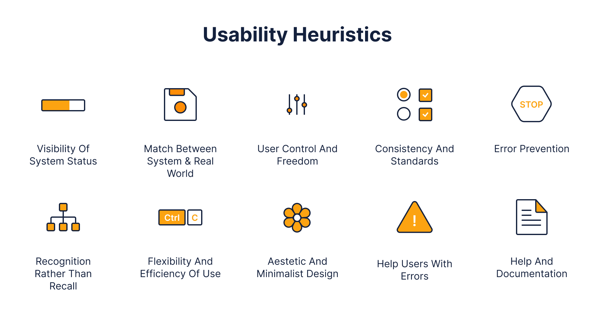

# Design and New Ideas

Christopher Robles 03/09/2023

One of my main goals has been to truly understand parts of the design process before a product is developed. This experience has been full of different appraoches and steps but one of the most important ones in my opinion is **heuristic analysis**. My interaction with this has been overall positive. I find myself doing it more often with other products that I find interesting outside of class. It's a really important idea to keep in mind when looking at new products and espeically your own product. With this, I've been able to fully understand the idea of this analysis and apply it to my own project in the class effectively. 

It's cool being able to use this tool outside of the class. I find it a great skill to practice to better understand the quality of the product you're using/looking at.

